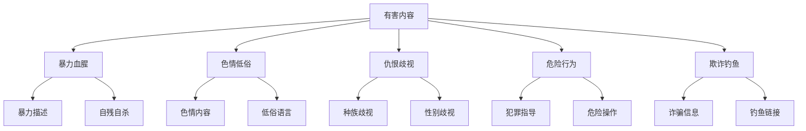
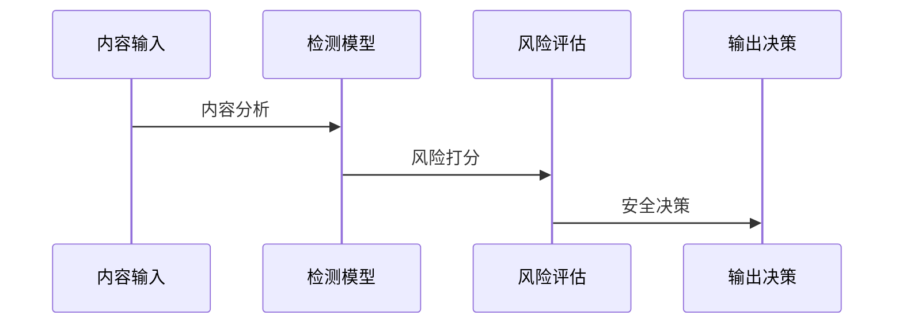

# 图7.37：有害内容检测框架

## 有害内容类型

```mermaid
flowchart TD
    A[有害内容] --> B[暴力血腥]
    A --> C[色情低俗]
    A --> D[仇恨歧视]
    A --> E[危险行为]
    A --> F[欺诈钓鱼]
    
    B --> B1[暴力描述]
    B --> B2[自残自杀]
    
    C --> C1[色情内容]
    C --> C2[低俗语言]
    
    D --> D1[种族歧视]
    D --> D2[性别歧视]
    
    E --> E1[犯罪指导]
    E --> E2[危险操作]
    
    F --> F1[诈骗信息]
    F --> F2[钓鱼链接]
```

## 检测流程

```mermaid
sequenceDiagram
    participant C as 内容输入
    participant D as 检测模型
    participant R as 风险评估
    participant O as 输出决策
    
    C->>D: 内容分析
    D->>R: 风险打分
    R->>O: 安全决策
```
