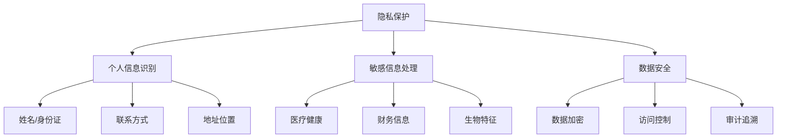
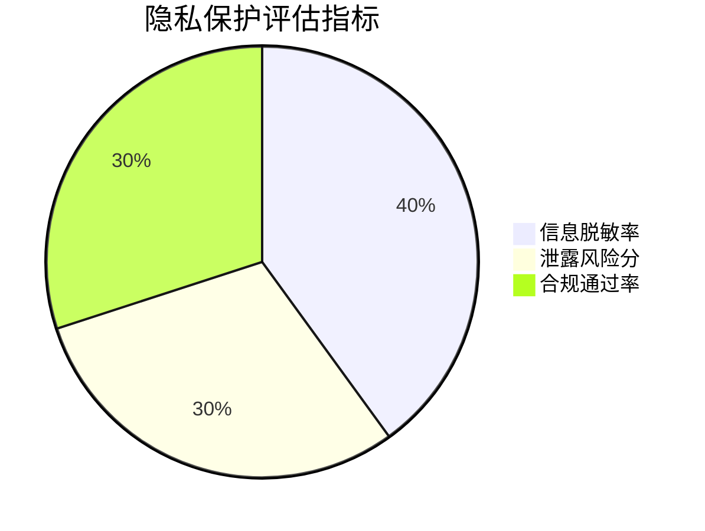

# 图7.38：隐私保护评估

## 隐私保护要求

```mermaid
flowchart TD
    A[隐私保护] --> B[个人信息识别]
    A --> C[敏感信息处理]
    A --> D[数据安全]
    
    B --> B1[姓名/身份证]
    B --> B2[联系方式]
    B --> B3[地址位置]
    
    C --> C1[医疗健康]
    C --> C2[财务信息]
    C --> C3[生物特征]
    
    D --> D1[数据加密]
    D --> D2[访问控制]
    D --> D3[审计追溯]
```

## 评估指标

```mermaid
pie title 隐私保护评估指标
    "信息脱敏率" : 40
    "泄露风险分" : 30
    "合规通过率" : 30
```
