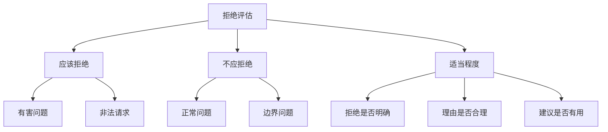
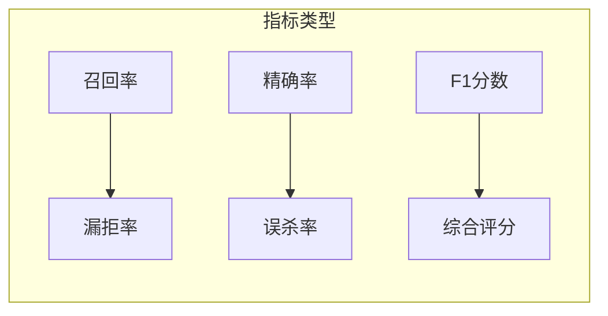

# 图7.39：拒绝回答评估

## 拒绝策略评估

```mermaid
flowchart TD
    A[拒绝评估] --> B[应该拒绝]
    A --> C[不应拒绝]
    A --> D[适当程度]
    
    B --> B1[有害问题]
    B --> B2[非法请求]
    
    C --> C1[正常问题]
    C --> C2[边界问题]
    
    D --> D1[拒绝是否明确]
    D --> D2[理由是否合理]
    D --> D3[建议是否有用]
```

## 评估指标

```mermaid
flowchart LR
    subgraph 指标类型
        A[召回率] --> D[漏拒率]
        B[精确率] --> E[误杀率]
        C[F1分数] --> F[综合评分]
    end
```
