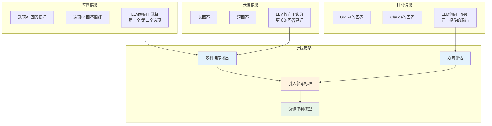

```mermaid
flowchart TB
    subgraph "位置偏见"
        A["选项A: 回答很好"]
        B["选项B: 回答很好"]
        C[LLM倾向于选择<br/>第一个/第二个选项]
    end
    
    subgraph "长度偏见"
        D["长回答"]
        E["短回答"]
        F[LLM倾向于认为<br/>更长的回答更好]
    end
    
    subgraph "自利偏见"
        G["GPT-4的回答"]
        H["Claude的回答"]
        I[LLM倾向于偏好<br/>同一模型的输出]
    end
    
    subgraph "对抗策略"
        J[随机排序输出]
        K[双向评估]
        L[引入参考标准]
        M[微调评判模型]
    end
    
    C --> J
    F --> J
    I --> K
    J --> L
    K --> L
    L --> M
    
    style J fill:#e3f2fd
    style K fill:#e3f2fd
    style L fill:#fff3e0
    style M fill:#e8f5e9
```
