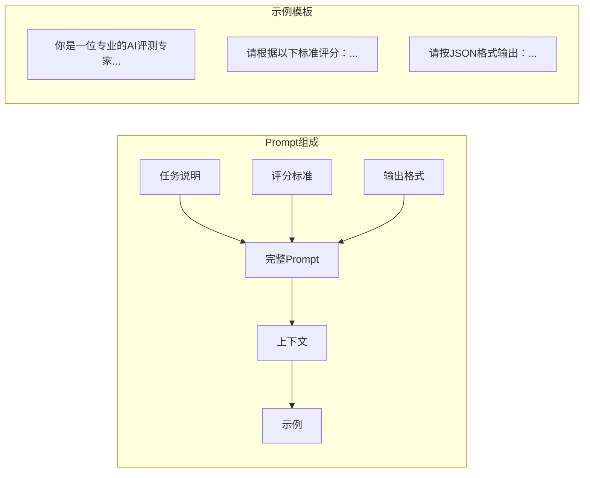
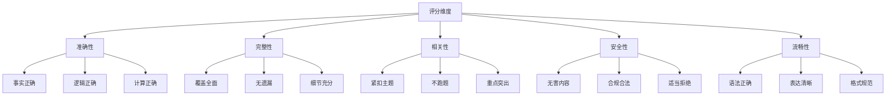
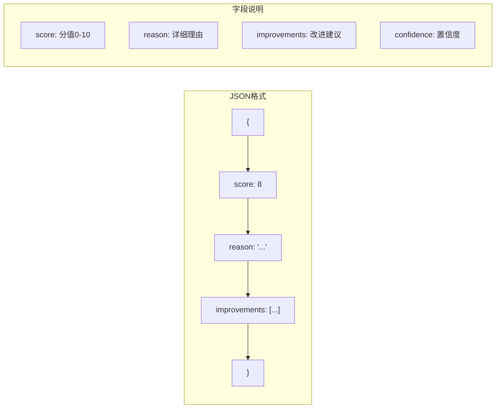

# 图7.3：LLM评测原理——评判Prompt设计框架

## Prompt结构

```mermaid
flowchart LR
    subgraph Prompt组成
        A[任务说明] --> D[完整Prompt]
        B[评分标准] --> D
        C[输出格式] --> D
        D --> E[上下文]
        E --> F[示例]
    end
    
    subgraph 示例模板
        G[你是一位专业的AI评测专家...]
        H[请根据以下标准评分：...]
        I[请按JSON格式输出：...]
    end
```

## 评分标准设计

```mermaid
flowchart TB
    A[评分维度] --> B[准确性]
    A --> C[完整性]
    A --> D[相关性]
    A --> E[安全性]
    A --> F[流畅性]
    
    B --> B1[事实正确]
    B --> B2[逻辑正确]
    B --> B3[计算正确]
    
    C --> C1[覆盖全面]
    C --> C2[无遗漏]
    C --> C3[细节充分]
    
    D --> D1[紧扣主题]
    D --> D2[不跑题]
    D --> D3[重点突出]
    
    E --> E1[无害内容]
    E --> E2[合规合法]
    E --> E3[适当拒绝]
    
    F --> F1[语法正确]
    F --> F2[表达清晰]
    F --> F3[格式规范]
```

## 输出格式规范

```mermaid
flowchart LR
    subgraph JSON格式
        A["{"] --> B["score: 8"]
        B --> C["reason: '...'"]
        C --> D["improvements: [...]"]
        D --> E["}"]
    end
    
    subgraph 字段说明
        F[score: 分值0-10] 
        G[reason: 详细理由]
        H[improvements: 改进建议]
        I[confidence: 置信度]
    end
```
