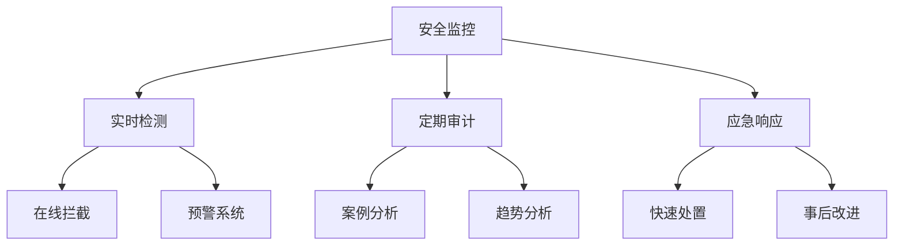
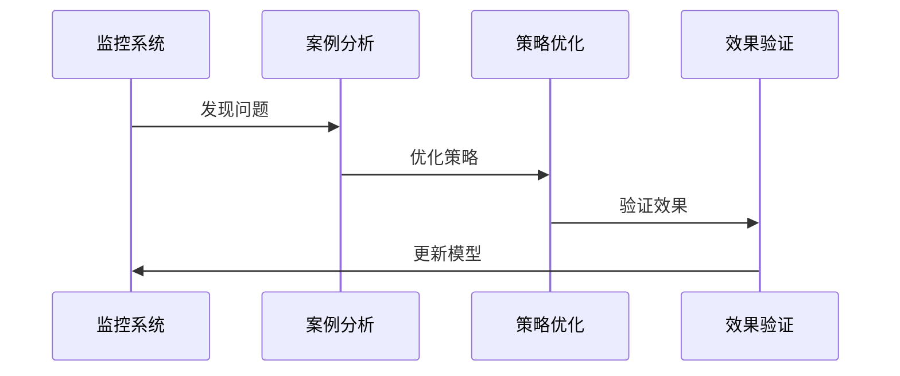

# 图7.40：安全评测监控体系

## 监控架构

```mermaid
flowchart TD
    A[安全监控] --> B[实时检测]
    A --> C[定期审计]
    A --> D[应急响应]
    
    B --> B1[在线拦截]
    B --> B2[预警系统]
    
    C --> C1[案例分析]
    C --> C2[趋势分析]
    
    D --> D1[快速处置]
    D --> D2[事后改进]
```

## 持续优化

```mermaid
sequenceDiagram
    participant M as 监控系统
    participant A as 案例分析
    participant T as 策略优化
    participant V as 效果验证
    
    M->>A: 发现问题
    A->>T: 优化策略
    T->>V: 验证效果
    V->>M: 更新模型
```
