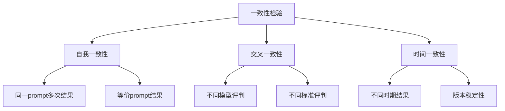

# 图7.41：一致性检验——评判结果可靠性保障

## 一致性类型

```mermaid
flowchart TD
    A[一致性检验] --> B[自我一致性]
    A --> C[交叉一致性]
    A --> D[时间一致性]
    
    B --> B1[同一prompt多次结果]
    B --> B2[等价prompt结果]
    
    C --> C1[不同模型评判]
    C --> C2[不同标准评判]
    
    D --> D1[不同时期结果]
    D --> D2[版本稳定性]
```
