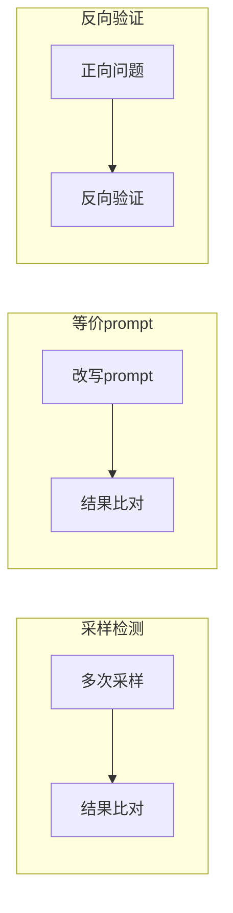
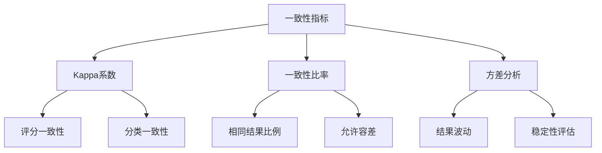

# 图7.42：自我一致性检验

## 检验方法

```mermaid
flowchart LR
    subgraph 采样检测
        A1[多次采样] --> A2[结果比对]
    end
    
    subgraph 等价prompt
        B1[改写prompt] --> B2[结果比对]
    end
    
    subgraph 反向验证
        C1[正向问题] --> C2[反向验证]
    end
```

## 一致性度量

```mermaid
flowchart TD
    A[一致性指标] --> B[Kappa系数]
    A --> C[一致性比率]
    A --> D[方差分析]
    
    B --> B1[评分一致性]
    B --> B2[分类一致性]
    
    C --> C1[相同结果比例]
    C --> C2[允许容差]
    
    D --> D1[结果波动]
    D --> D2[稳定性评估]
```
