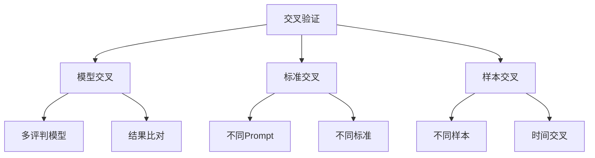

# 图7.43：交叉验证方法

## 交叉验证框架

```mermaid
flowchart TD
    A[交叉验证] --> B[模型交叉]
    A --> C[标准交叉]
    A --> D[样本交叉]
    
    B --> B1[多评判模型]
    B --> B2[结果比对]
    
    C --> C1[不同Prompt]
    C --> C2[不同标准]
    
    D --> D1[不同样本]
    D --> D2[时间交叉]
```
