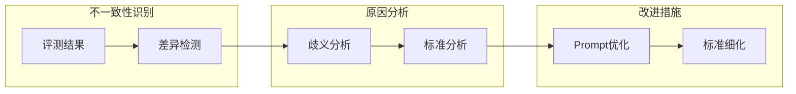
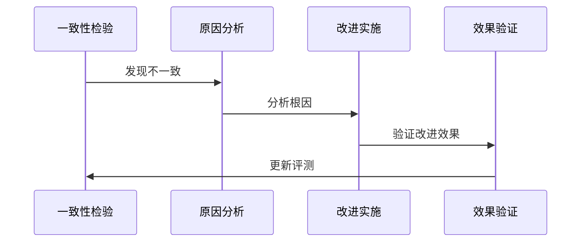

# 图7.44：一致性分析与改进

## 分析方法

```mermaid
flowchart LR
    subgraph 不一致性识别
        A[评测结果] --> D[差异检测]
    end
    
    subgraph 原因分析
        D --> E[歧义分析]
        E --> F[标准分析]
    end
    
    subgraph 改进措施
        F --> G[Prompt优化]
        G --> H[标准细化]
    end
```

## 改进流程

```mermaid
sequenceDiagram
    participant C as 一致性检验
    participant A as 原因分析
    participant I as 改进实施
    participant V as 效果验证
    
    C->>A: 发现不一致
    A->>I: 分析根因
    I->>V: 验证改进效果
    V->>C: 更新评测
```
