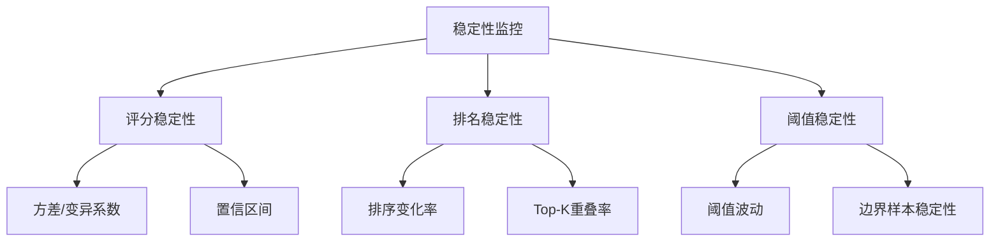
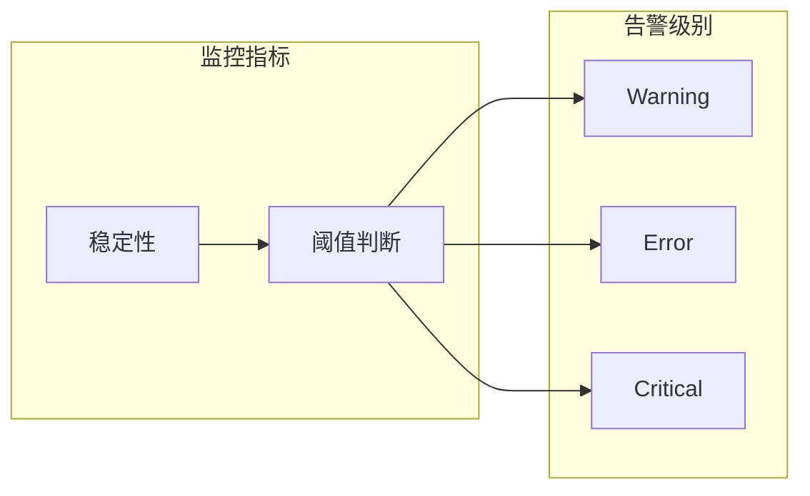

# 图7.45：稳定性监控体系

## 监控指标

```mermaid
flowchart TD
    A[稳定性监控] --> B[评分稳定性]
    A --> C[排名稳定性]
    A --> D[阈值稳定性]
    
    B --> B1[方差/变异系数]
    B --> B2[置信区间]
    
    C --> C1[排序变化率]
    C --> C2[Top-K重叠率]
    
    D --> D1[阈值波动]
    D --> D2[边界样本稳定性]
```

## 告警机制

```mermaid
flowchart LR
    subgraph 监控指标
        A[稳定性] --> D[阈值判断]
    end
    
    subgraph 告警级别
        D --> E[Warning]
        D --> F[Error]
        D --> G[Critical]
    end
```
