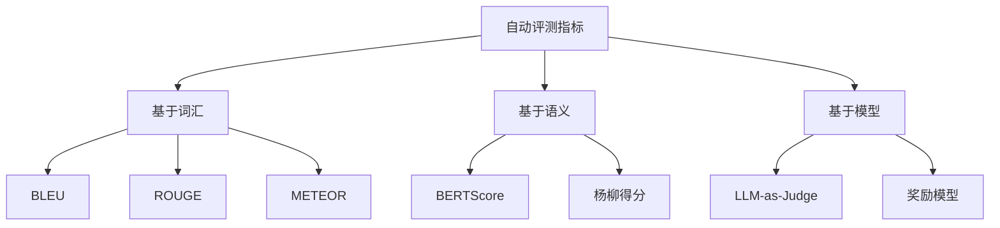

# 图7.46：自动评测指标体系

## 指标分类

```mermaid
flowchart TD
    A[自动评测指标] --> B[基于词汇]
    A --> C[基于语义]
    A --> D[基于模型]
    
    B --> B1[BLEU]
    B --> B2[ROUGE]
    B --> B3[METEOR]
    
    C --> C1[BERTScore]
    C --> C2[杨柳得分]
    
    D --> D1[LLM-as-Judge]
    D --> D2[奖励模型]
```
