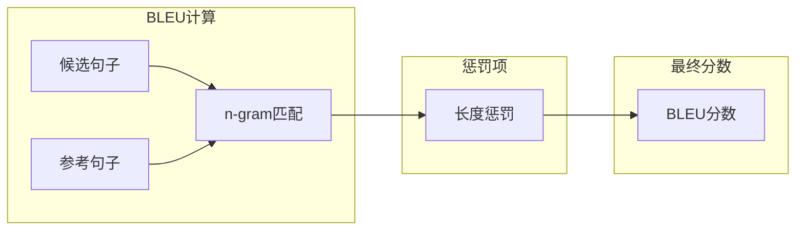
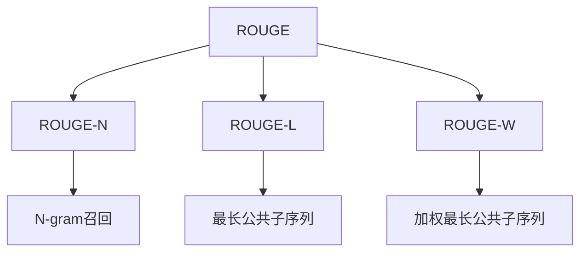

# 图7.47：词汇级指标详解

## BLEU指标

```mermaid
flowchart LR
    subgraph BLEU计算
        A[候选句子] --> D[n-gram匹配]
        B[参考句子] --> D
    end
    
    subgraph 惩罚项
        D --> E[长度惩罚]
    end
    
    subgraph 最终分数
        E --> F[BLEU分数]
    end
```

## ROUGE指标

```mermaid
flowchart TD
    A[ROUGE] --> B[ROUGE-N]
    A --> C[ROUGE-L]
    A --> D[ROUGE-W]
    
    B --> B1[N-gram召回]
    C --> C1[最长公共子序列]
    D --> C2[加权最长公共子序列]
```
