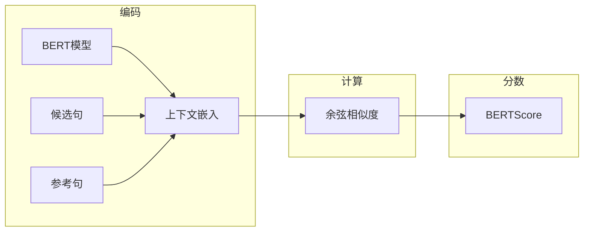
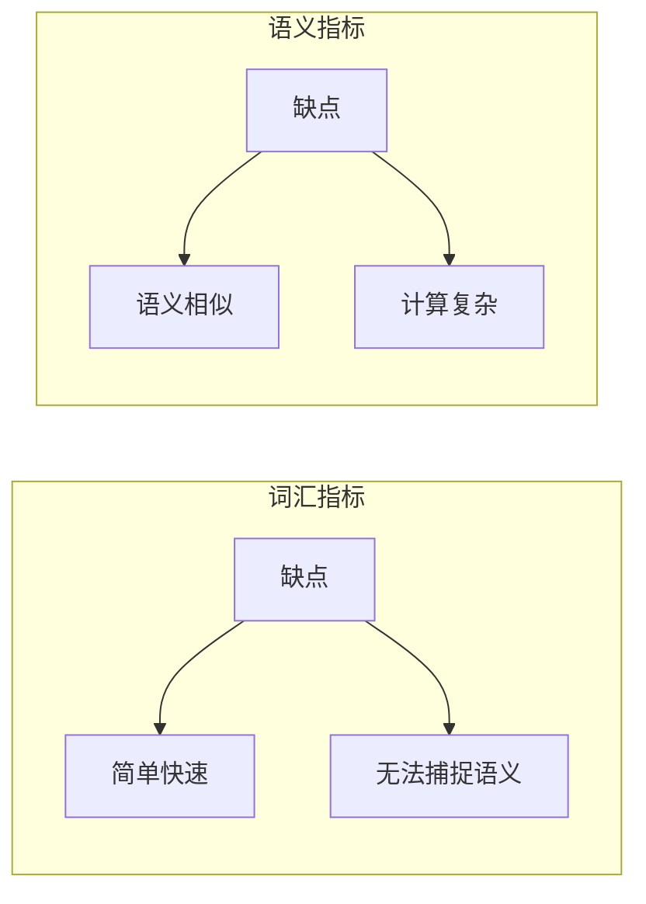

# 图7.48：语义级指标详解

## BERTScore

```mermaid
flowchart LR
    subgraph 编码
        A[BERT模型] --> D[上下文嵌入]
        B[候选句] --> D
        C[参考句] --> D
    end
    
    subgraph 计算
        D --> E[余弦相似度]
    end
    
    subgraph 分数
        E --> F[BERTScore]
    end
```

## 优势对比

```mermaid
flowchart LR
    subgraph 词汇指标
        A[优点] --> D[简单快速]
        A[缺点] --> E[无法捕捉语义]
    end
    
    subgraph 语义指标
        B[优点] --> F[语义相似]
        B[缺点] --> G[计算复杂]
    end
```
