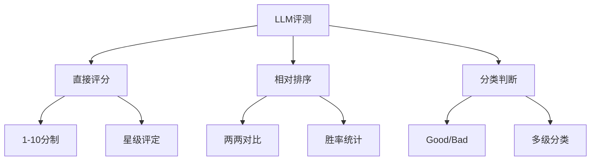
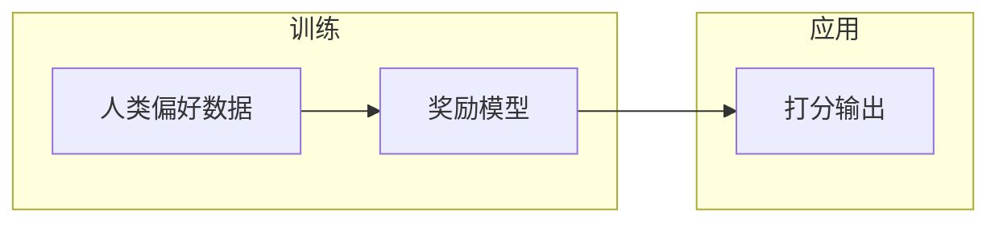

# 图7.49：模型级指标

## LLM-as-Judge

```mermaid
flowchart TD
    A[LLM评测] --> B[直接评分]
    A --> C[相对排序]
    A --> D[分类判断]
    
    B --> B1[1-10分制]
    B --> B2[星级评定]
    
    C --> C1[两两对比]
    C --> C2[胜率统计]
    
    D --> D1[Good/Bad]
    D --> D2[多级分类]
```

## 奖励模型

```mermaid
flowchart LR
    subgraph 训练
        A[人类偏好数据] --> D[奖励模型]
    end
    
    subgraph 应用
        D --> E[打分输出]
    end
```
