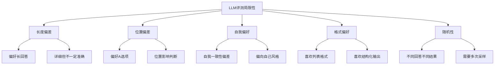
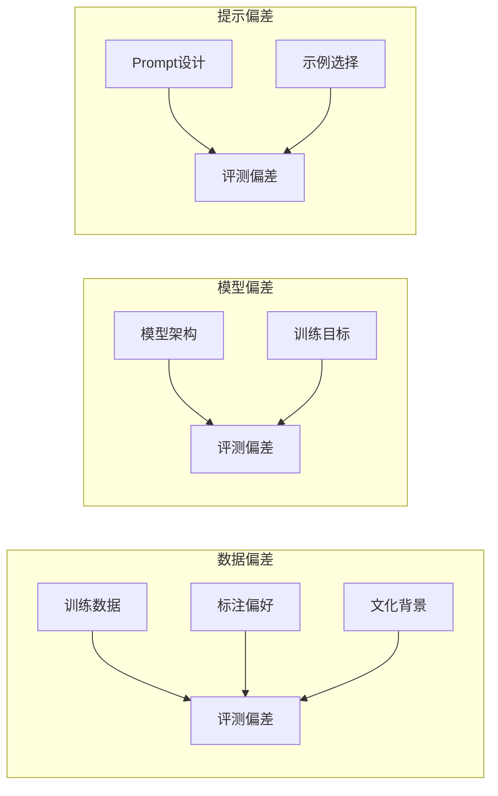
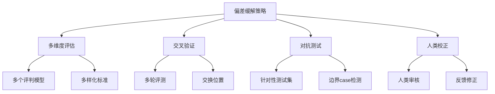

# 图7.4：LLM评测原理——评估局限性分析

## 固有局限性

```mermaid
flowchart TD
    A[LLM评测局限性] --> B[长度偏差]
    A --> C[位置偏差]
    A --> D[自我偏好]
    A --> E[格式偏好]
    A --> F[随机性]
    
    B --> B1[偏好长回答]
    B --> B2[详细但不一定准确]
    
    C --> C1[偏好A选项]
    C --> C2[位置影响判断]
    
    D --> D1[自我一致性偏差]
    D --> D2[偏向自己风格]
    
    E --> E1[喜欢列表格式]
    E --> E2[喜欢结构化输出]
    
    F --> F1[不同回答不同结果]
    F --> F2[需要多次采样]
```

## 偏差来源分析

```mermaid
flowchart LR
    subgraph 数据偏差
        A[训练数据] --> D[评测偏差]
        B[标注偏好] --> D
        C[文化背景] --> D
    end
    
    subgraph 模型偏差
        E[模型架构] --> G[评测偏差]
        F[训练目标] --> G
    end
    
    subgraph 提示偏差
        H[Prompt设计] --> J[评测偏差]
        I[示例选择] --> J
    end
```

## 缓解策略

```mermaid
flowchart TB
    A[偏差缓解策略] --> B[多维度评估]
    A --> C[交叉验证]
    A --> D[对抗测试]
    A --> E[人类校正]
    
    B --> B1[多个评判模型]
    B --> B2[多样化标准]
    
    C --> C1[多轮评测]
    C --> C2[交换位置]
    
    D --> D1[针对性测试集]
    D --> D2[边界case检测]
    
    E --> E1[人类审核]
    E --> E2[反馈修正]
```
