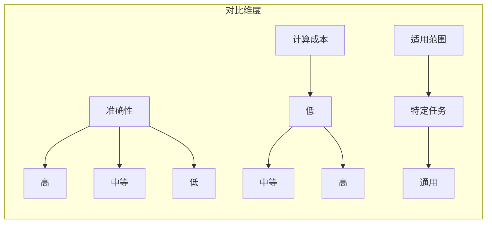
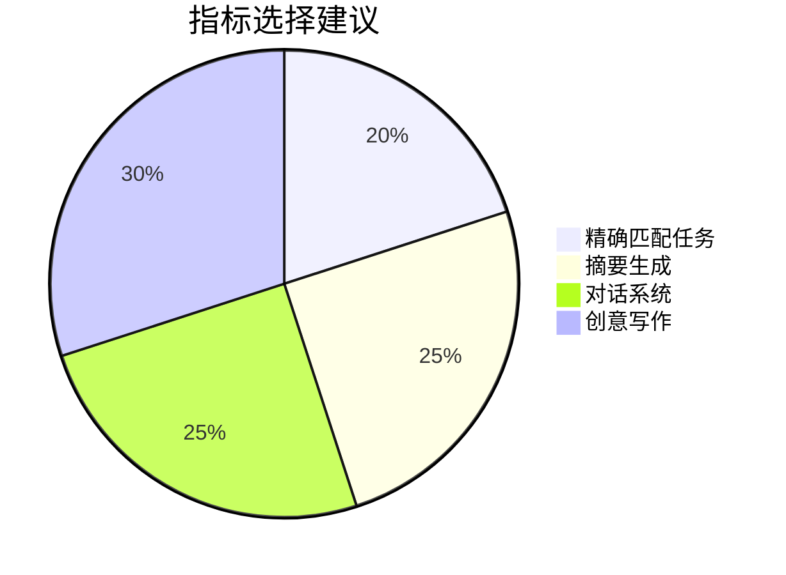
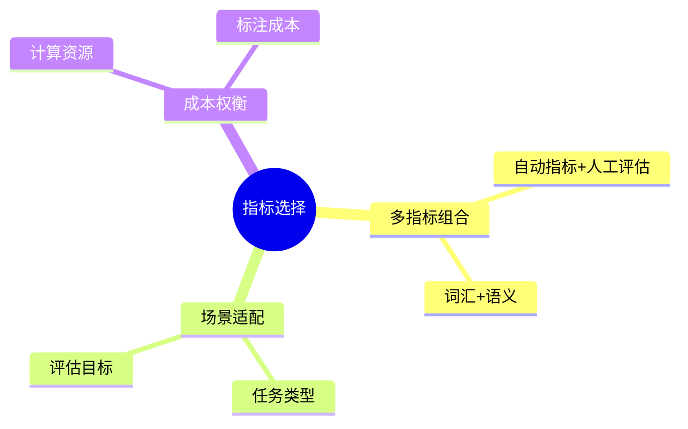

# 图7.50：指标对比与选择

## 指标对比矩阵

```mermaid
flowchart LR
    subgraph 对比维度
        A[准确性] --> D[高]
        A --> E[中等]
        A --> F[低]
        
        B[计算成本] --> G[低]
        G --> H[中等]
        G --> I[高]
        
        C[适用范围] --> J[特定任务]
        J --> K[通用]
    end
```

## 选择指南

```mermaid
pie title 指标选择建议
    "精确匹配任务" : 20
    "摘要生成" : 25
    "对话系统" : 25
    "创意写作" : 30
```

## 实践建议

```mermaid
mindmap
  root((指标选择))
    多指标组合
      自动指标+人工评估
      词汇+语义
    场景适配
      任务类型
      评估目标
    成本权衡
      计算资源
      标注成本
```
