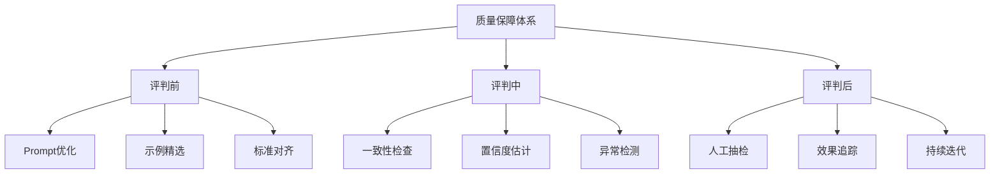
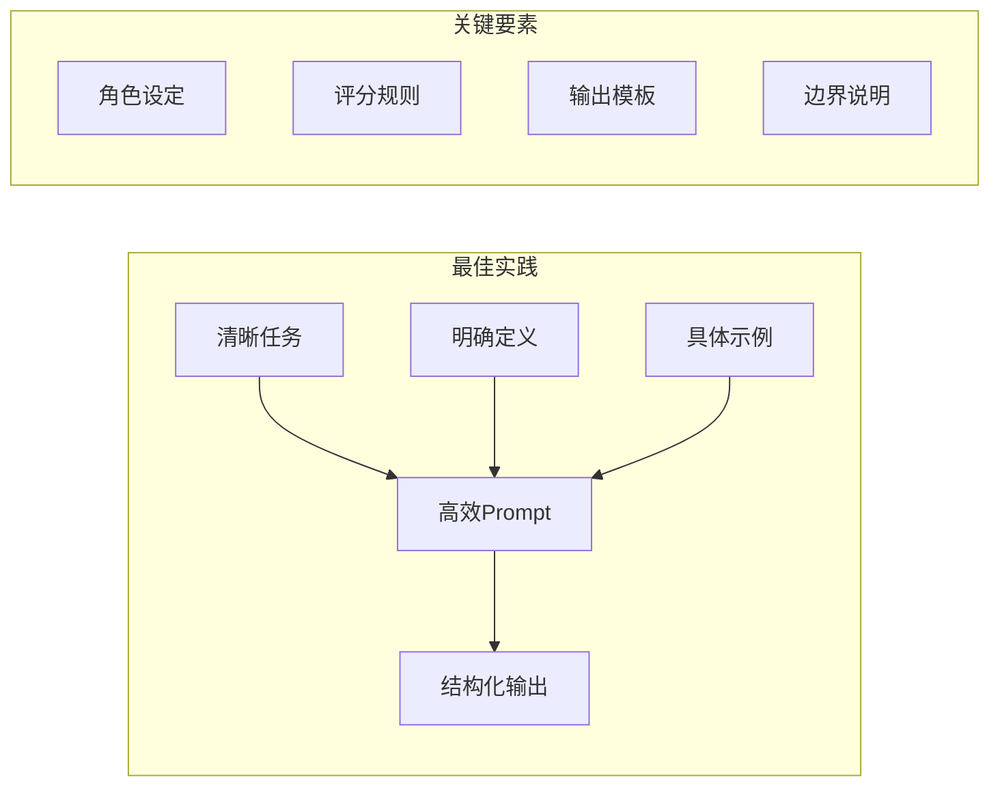
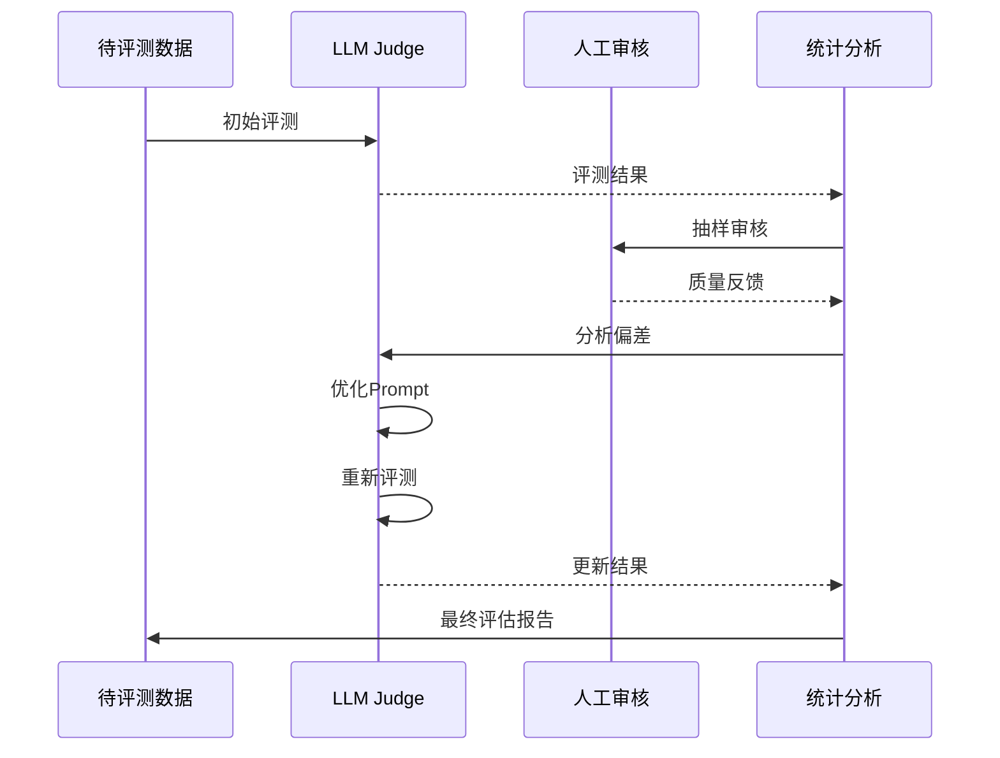

# 图7.5：LLM评测原理——评判质量优化方法

## 评判质量保障体系

```mermaid
flowchart TD
    A[质量保障体系] --> B[评判前]
    A --> C[评判中]
    A --> D[评判后]
    
    B --> B1[Prompt优化]
    B --> B2[示例精选]
    B --> B3[标准对齐]
    
    C --> C1[一致性检查]
    C --> C2[置信度估计]
    C --> C3[异常检测]
    
    D --> D1[人工抽检]
    D --> D2[效果追踪]
    D --> D3[持续迭代]
```

## Prompt工程最佳实践

```mermaid
flowchart LR
    subgraph 最佳实践
        A[清晰任务] --> D[高效Prompt]
        B[明确定义] --> D
        C[具体示例] --> D
        D --> E[结构化输出]
    end
    
    subgraph 关键要素
        F[角色设定]
        G[评分规则]
        H[输出模板]
        I[边界说明]
    end
```

## 迭代优化流程

```mermaid
sequenceDiagram
    participant D as 待评测数据
    participant J as LLM Judge
    participant H as 人工审核
    participant S as 统计分析
    
    D->>J: 初始评测
    J-->>S: 评测结果
    
    S->>H: 抽样审核
    H-->>S: 质量反馈
    
    S->>J: 分析偏差
    J->>J: 优化Prompt
    
    J->>J: 重新评测
    J-->>S: 更新结果
    
    S->>D: 最终评估报告
```
