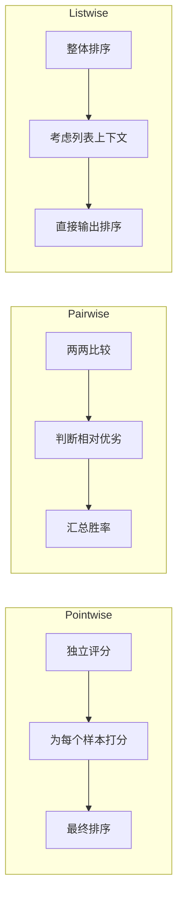
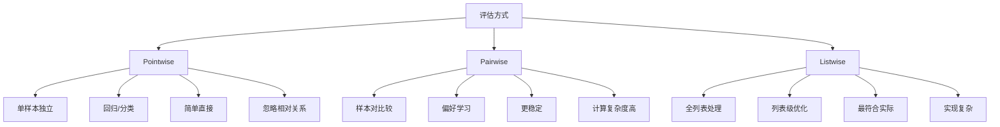

# 图7.6：Pointwise vs Pairwise vs Listwise——三种评估范式概述

## 三种范式对比

```mermaid
flowchart LR
    subgraph Pointwise
        A1[独立评分] --> A2[为每个样本打分]
        A2 --> A3[最终排序]
    end
    
    subgraph Pairwise
        B1[两两比较] --> B2[判断相对优劣]
        B2 --> B3[汇总胜率]
    end
    
    subgraph Listwise
        C1[整体排序] --> C2[考虑列表上下文]
        C2 --> C3[直接输出排序]
    end
```

## 核心差异

```mermaid
flowchart TB
    A[评估方式] --> B[Pointwise]
    A --> C[Pairwise]
    A --> D[Listwise]
    
    B --> B1[单样本独立]
    B --> B2[回归/分类]
    B --> B3[简单直接]
    B --> B4[忽略相对关系]
    
    C --> C1[样本对比较]
    C --> C2[偏好学习]
    C --> C3[更稳定]
    C --> C4[计算复杂度高]
    
    D --> D1[全列表处理]
    D --> D2[列表级优化]
    D --> D3[最符合实际]
    D --> D4[实现复杂]
```
