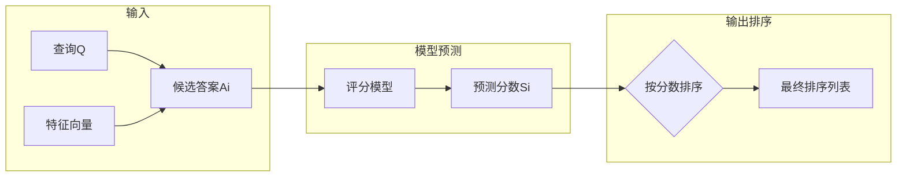
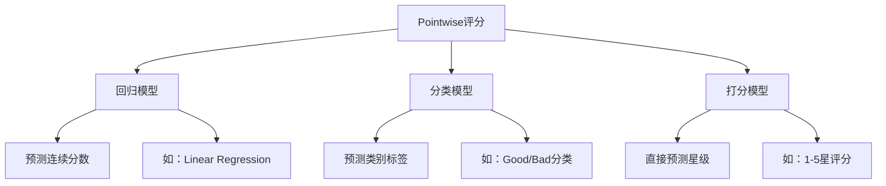
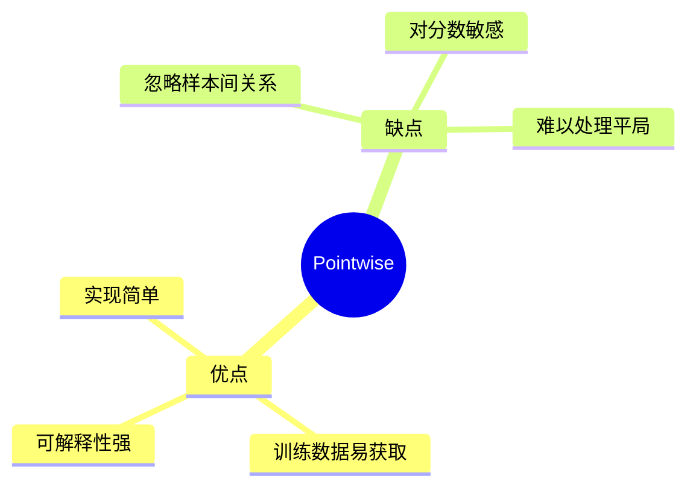

# 图7.7：Pointwise评估方法详解

## Pointwise流程

```mermaid
flowchart LR
    subgraph 输入
        A[查询Q] --> D[候选答案Ai]
        B[特征向量] --> D
    end
    
    subgraph 模型预测
        D --> E[评分模型]
        E --> F[预测分数Si]
    end
    
    subgraph 输出排序
        F --> G{按分数排序}
        G --> H[最终排序列表]
    end
```

## 评分模型类型

```mermaid
flowchart TD
    A[Pointwise评分] --> B[回归模型]
    A --> C[分类模型]
    A --> D[打分模型]
    
    B --> B1[预测连续分数]
    B --> B2[如：Linear Regression]
    
    C --> C1[预测类别标签]
    C --> C2[如：Good/Bad分类]
    
    D --> D1[直接预测星级]
    D --> D2[如：1-5星评分]
```

## 优缺点分析

```mermaid
mindmap
  root((Pointwise))
    优点
      实现简单
      训练数据易获取
      可解释性强
    缺点
      忽略样本间关系
      对分数敏感
      难以处理平局
```
