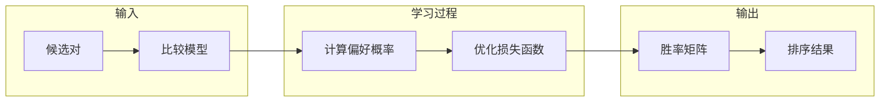
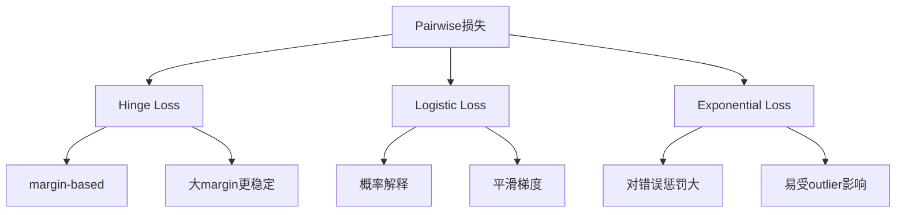
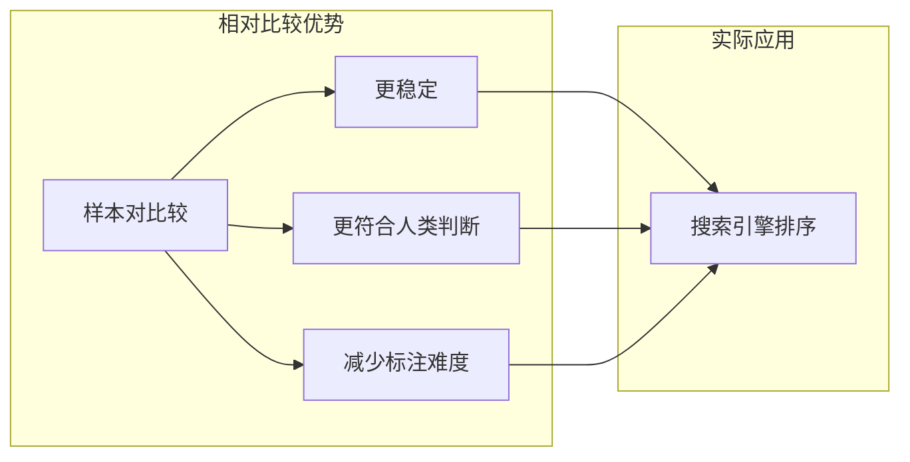

# 图7.8：Pairwise评估方法详解

## Pairwise流程

```mermaid
flowchart LR
    subgraph 输入
        A[候选对<i,j>] --> D[比较模型]
    end
    
    subgraph 学习过程
        D --> E[计算偏好概率]
        E --> F[优化损失函数]
    end
    
    subgraph 输出
        F --> G[胜率矩阵]
        G --> H[排序结果]
    end
```

## 损失函数设计

```mermaid
flowchart TD
    A[Pairwise损失] --> B[Hinge Loss]
    A --> C[Logistic Loss]
    A --> D[Exponential Loss]
    
    B --> B1[margin-based]
    B --> B2[大margin更稳定]
    
    C --> C1[概率解释]
    C --> C2[平滑梯度]
    
    D --> D1[对错误惩罚大]
    D --> D2[易受outlier影响]
```

## 优势分析

```mermaid
flowchart LR
    subgraph 相对比较优势
        A[样本对比较] --> D[更稳定]
        A --> E[更符合人类判断]
        A --> F[减少标注难度]
    end
    
    subgraph 实际应用
        D --> G[搜索引擎排序]
        E --> G
        F --> G
    end
```
