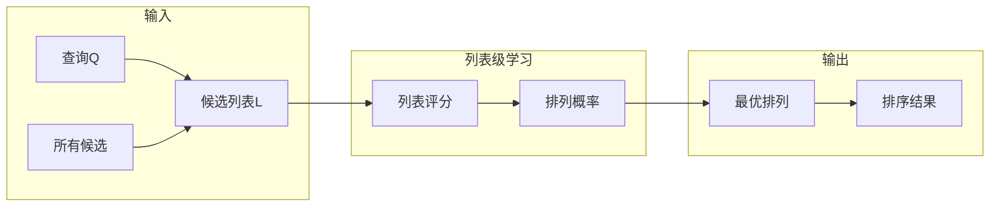
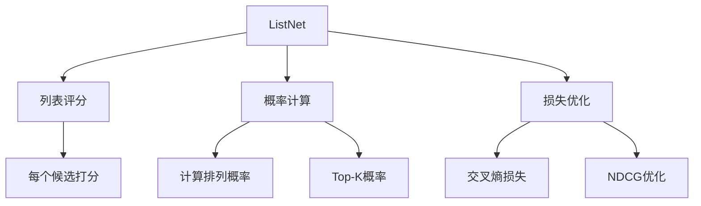

# 图7.9：Listwise评估方法详解

## Listwise流程



## ListNet算法



## 与其他方法对比

```mermaid
flowchart LR
    subgraph 复杂度
        A[Pointwise] --> D[O(n)]
        B[Pairwise] --> D
        C[Listwise] --> E[O(n!)]
    end
    
    subgraph 精度
        A --> F[较低]
        B --> G[中等]
        C --> H[最高]
    end
```
