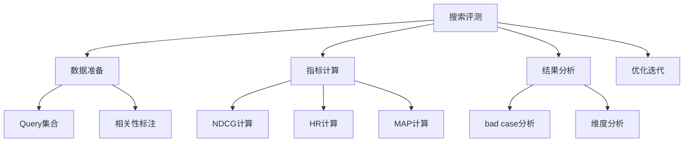

# 图8.10：搜索评测框架

## 评测流程

```mermaid
flowchart TD
    A[搜索评测] --> B[数据准备]
    A --> C[指标计算]
    A --> D[结果分析]
    A --> E[优化迭代]
    
    B --> B1[Query集合]
    B --> B2[相关性标注]
    
    C --> C1[NDCG计算]
    C --> C2[HR计算]
    C --> C3[MAP计算]
    
    D --> D1[bad case分析]
    D --> D2[维度分析]
```
