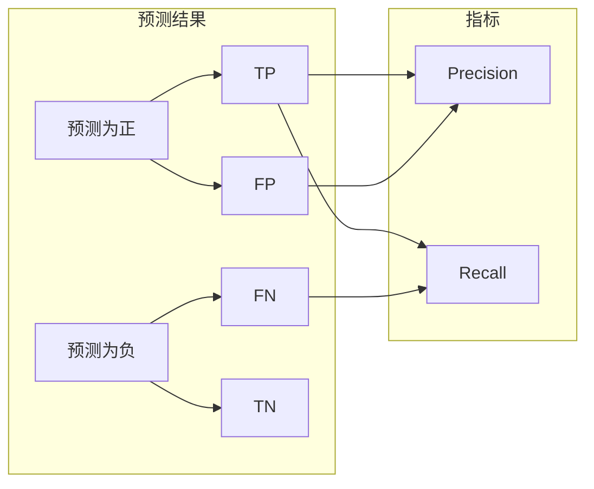
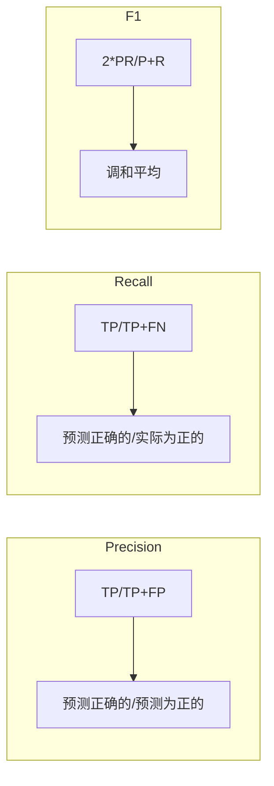

# 图8.11：Precision/Recall/F1原理

## 基础概念

```mermaid
flowchart LR
    subgraph 预测结果
        A[预测为正] --> D[TP]
        A --> E[FP]
        B[预测为负] --> F[FN]
        B --> G[TN]
    end
    
    subgraph 指标
        D --> P[Precision]
        E --> P
        D --> R[Recall]
        F --> R
    end
```

## 计算公式

```mermaid
flowchart LR
    subgraph Precision
        A[TP/TP+FP] --> D[预测正确的/预测为正的]
    end
    
    subgraph Recall
        B[TP/TP+FN] --> E[预测正确的/实际为正的]
    end
    
    subgraph F1
        C[2*PR/P+R] --> F[调和平均]
    end
```
