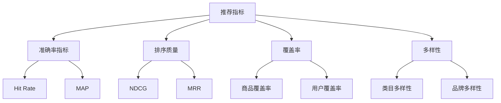

# 图8.12：推荐系统指标体系

## 推荐特有指标

```mermaid
flowchart TD
    A[推荐指标] --> B[准确率指标]
    A --> C[排序质量]
    A --> D[覆盖率]
    A --> E[多样性]
    
    B --> B1[Hit Rate]
    B --> B2[MAP]
    
    C --> C1[NDCG]
    C --> C2[MRR]
    
    D --> D1[商品覆盖率]
    D --> D2[用户覆盖率]
    
    E --> E1[类目多样性]
    E --> E2[品牌多样性]
```
