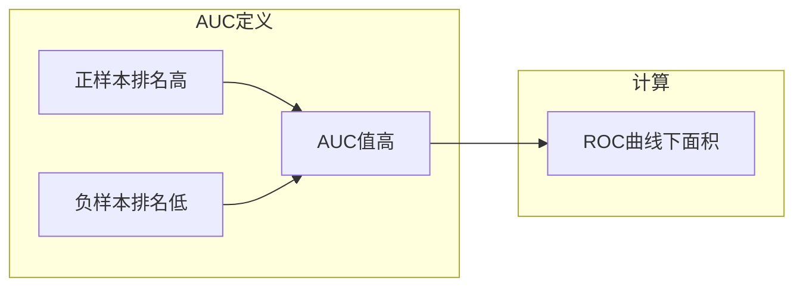
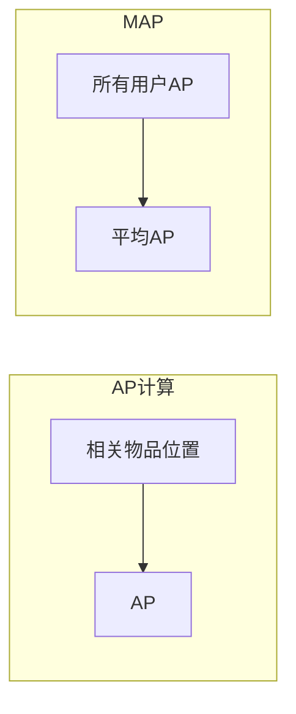

# 图8.13：排序质量评估

## AUC指标

```mermaid
flowchart LR
    subgraph AUC定义
        A[正样本排名高] --> D[AUC值高]
        B[负样本排名低] --> D
    end
    
    subgraph 计算
        D --> E[ROC曲线下面积]
    end
```

## MAP指标

```mermaid
flowchart LR
    subgraph AP计算
        A[相关物品位置] --> D[AP]
    end
    
    subgraph MAP
        B[所有用户AP] --> E[平均AP]
    end
```
