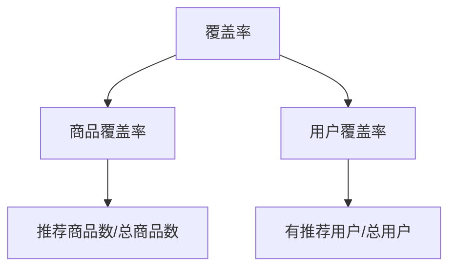
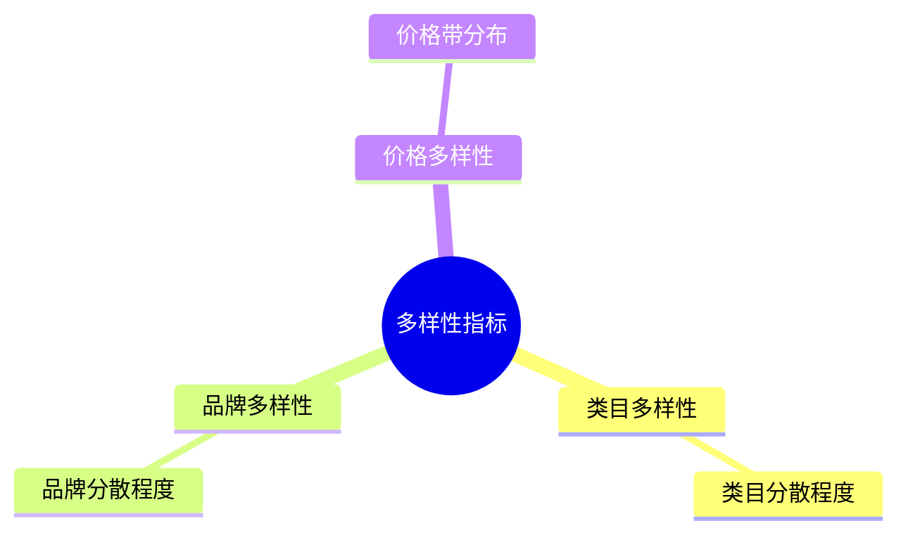

# 图8.14：覆盖率和多样性

## 覆盖率指标

```mermaid
flowchart TD
    A[覆盖率] --> B[商品覆盖率]
    A --> C[用户覆盖率]
    
    B --> B1[推荐商品数/总商品数]
    C --> C1[有推荐用户/总用户]
```

## 多样性

```mermaid
mindmap
  root((多样性指标))
    类目多样性
      类目分散程度
    品牌多样性
      品牌分散程度
    价格多样性
      价格带分布
```
