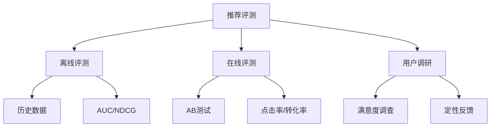
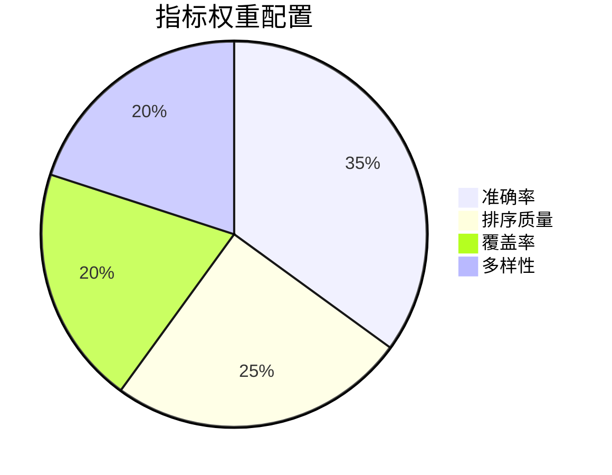

# 图8.15：推荐系统评测框架

## 评测流程

```mermaid
flowchart TD
    A[推荐评测] --> B[离线评测]
    A --> C[在线评测]
    A --> D[用户调研]
    
    B --> B1[历史数据]
    B --> B2[AUC/NDCG]
    
    C --> C1[AB测试]
    C --> C2[点击率/转化率]
    
    D --> D1[满意度调查]
    D --> D2[定性反馈]
```

## 指标选择

```mermaid
pie title 指标权重配置
    "准确率" : 35
    "排序质量" : 25
    "覆盖率" : 20
    "多样性" : 20
```
