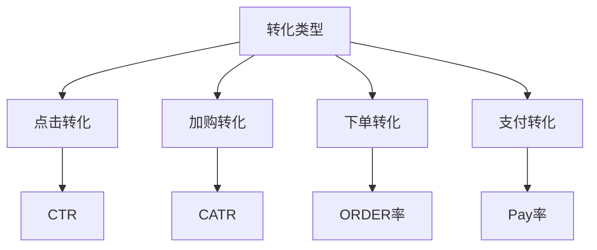
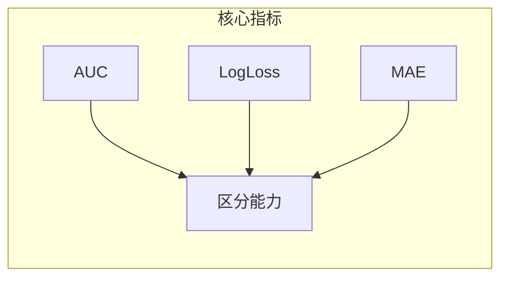

# 图8.16：转化率预测——评估目标与指标

## 转化率类型

```mermaid
flowchart TD
    A[转化类型] --> B[点击转化]
    A --> C[加购转化]
    A --> D[下单转化]
    A --> E[支付转化]
    
    B --> B1[CTR]
    C --> C1[CATR]
    D --> D1[ORDER率]
    E --> E1[Pay率]
```

## 评估指标

```mermaid
flowchart LR
    subgraph 核心指标
        A[AUC] --> D[区分能力]
        B[LogLoss] --> D
        C[MAE] --> D
    end
```
