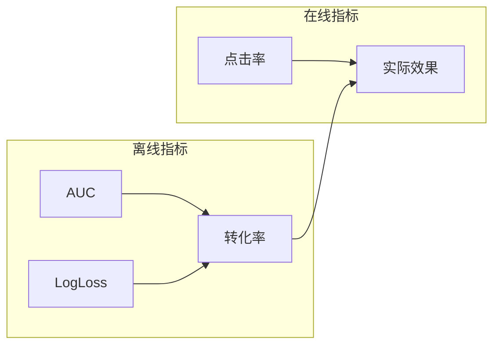
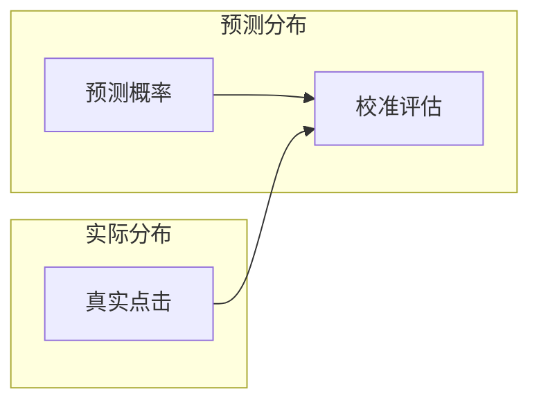

# 图8.17：点击率评估方法

## CTR预估评估

```mermaid
flowchart LR
    subgraph 离线指标
        A[AUC] --> D[排序能力]
        B[LogLoss] --> D
    end
    
    subgraph 在线指标
        C[点击率] --> E[实际效果]
        D[转化率] --> E
    end
```

## 校准评估

```mermaid
flowchart LR
    subgraph 预测分布
        A[预测概率] --> D[校准评估]
    end
    
    subgraph 实际分布
        B[真实点击] --> D
    end
```
