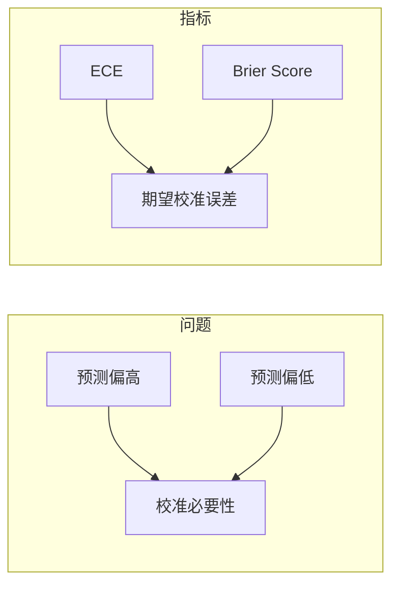
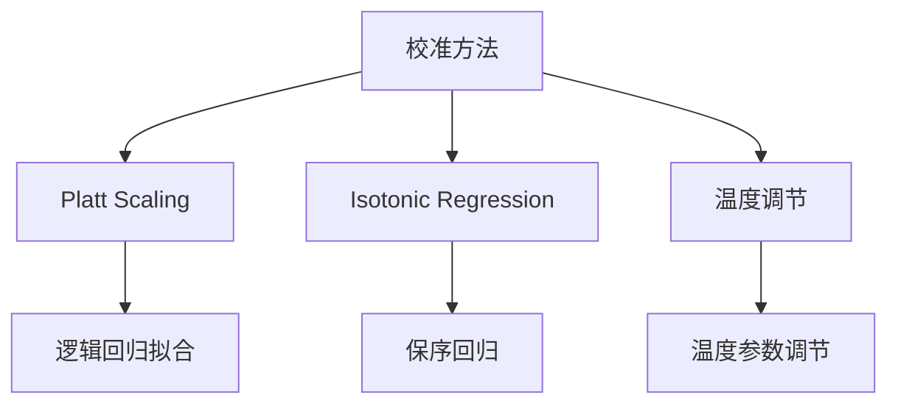

# 图8.18：转化率校准评估

## 校准重要性

```mermaid
flowchart LR
    subgraph 问题
        A[预测偏高] --> D[校准必要性]
        B[预测偏低] --> D
    end
    
    subgraph 指标
        C[ECE] --> E[期望校准误差]
        C1[Brier Score] --> E
    end
```

## 校准方法

```mermaid
flowchart TD
    A[校准方法] --> B[Platt Scaling]
    A --> C[Isotonic Regression]
    A --> D[温度调节]
    
    B --> B1[逻辑回归拟合]
    C --> C1[保序回归]
    D --> D2[温度参数调节]
```
