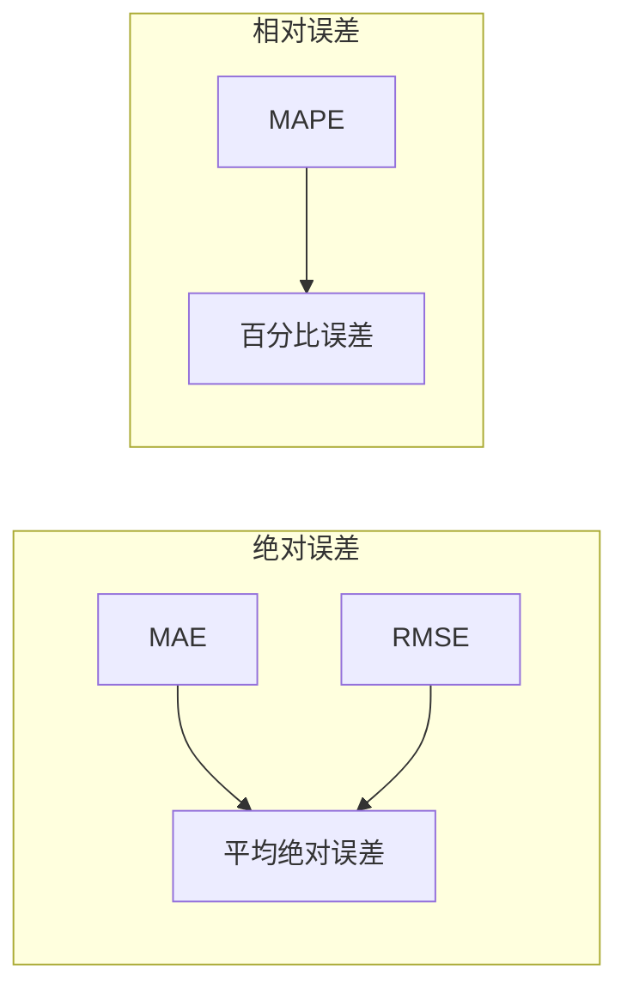

# 图8.19：预测质量评估指标

## 回归指标

```mermaid
flowchart LR
    subgraph 绝对误差
        A[MAE] --> D[平均绝对误差]
        B[RMSE] --> D
    end
    
    subgraph 相对误差
        C[MAPE] --> E[百分比误差]
    end
```

## 分类指标

```mermaid
flowchart LR
    subgraph 阈值指标
        A[Precision@K] --> D[Top-K精确率]
        B[Recall@K] --> D
    end
```
