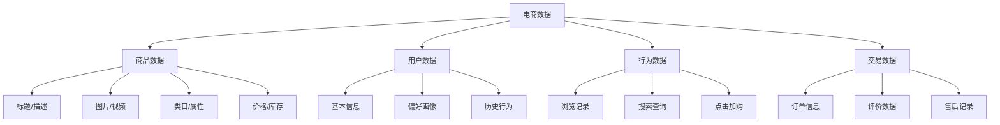

# 图8.1：电商数据特点——数据概述与挑战

## 电商数据组成

```mermaid
flowchart TD
    A[电商数据] --> B[商品数据]
    A --> C[用户数据]
    A --> D[行为数据]
    A --> E[交易数据]
    
    B --> B1[标题/描述]
    B --> B2[图片/视频]
    B --> B3[类目/属性]
    B --> B4[价格/库存]
    
    C --> C1[基本信息]
    C --> C2[偏好画像]
    C --> C3[历史行为]
    
    D --> D1[浏览记录]
    D --> D2[搜索查询]
    D --> D3[点击加购]
    
    E --> E1[订单信息]
    E --> E2[评价数据]
    E --> E3[售后记录]
```
