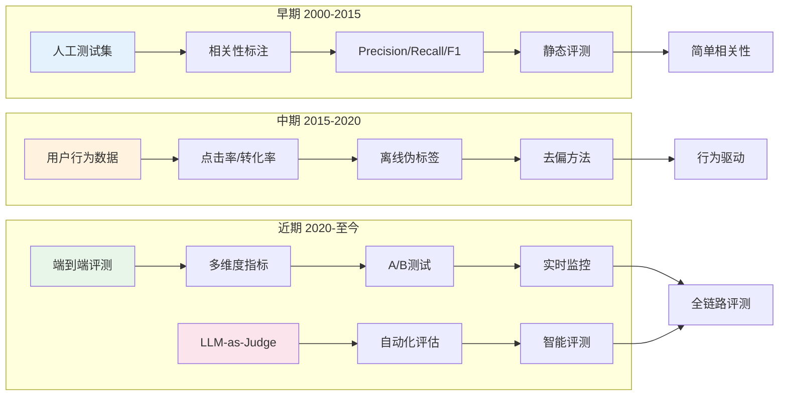

```mermaid
flowchart LR
    subgraph "早期 2000-2015"
        A[人工测试集] --> B[相关性标注]
        B --> C[Precision/Recall/F1]
        C --> D[静态评测]
    end
    
    subgraph "中期 2015-2020"
        E[用户行为数据] --> F[点击率/转化率]
        F --> G[离线伪标签]
        G --> H[去偏方法]
    end
    
    subgraph "近期 2020-至今"
        I[端到端评测] --> J[多维度指标]
        J --> K[A/B测试]
        K --> L[实时监控]
        
        M[LLM-as-Judge] --> N[自动化评估]
        N --> O[智能评测]
    end
    
    D --> P[简单相关性]
    H --> Q[行为驱动]
    L --> R[全链路评测]
    O --> R
    
    style A fill:#e3f2fd
    style E fill:#fff3e0
    style I fill:#e8f5e9
    style M fill:#fce4ec
```
