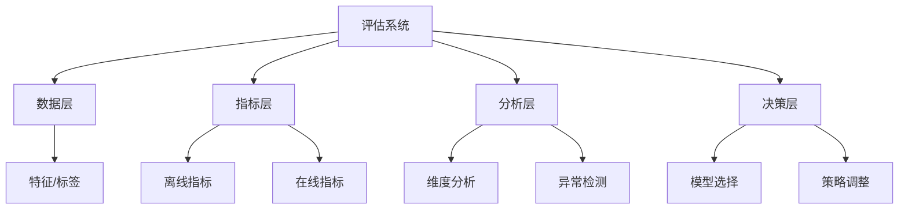
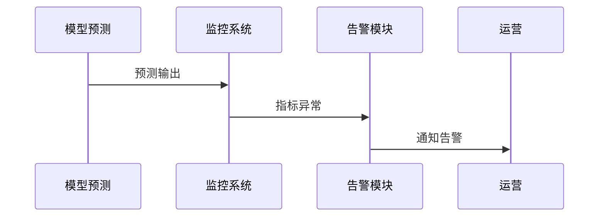

# 图8.20：转化率预测评估系统

## 评估框架

```mermaid
flowchart TD
    A[评估系统] --> B[数据层]
    A --> C[指标层]
    A --> D[分析层]
    A --> E[决策层]
    
    B --> B1[特征/标签]
    C --> C1[离线指标]
    C --> C2[在线指标]
    D --> D1[维度分析]
    D --> D2[异常检测]
    E --> E1[模型选择]
    E --> E2[策略调整]
```

## 持续监控

```mermaid
sequenceDiagram
    participant M as 模型预测
    participant C as 监控系统
    participant A as 告警模块
    participant O as 运营
    
    M->>C: 预测输出
    C->>A: 指标异常
    A->>O: 通知告警
```
