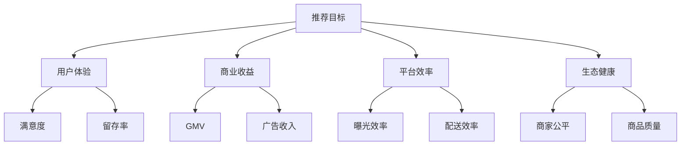

# 图8.21：多目标优化——目标定义与权衡

## 电商推荐目标

```mermaid
flowchart TD
    A[推荐目标] --> B[用户体验]
    A --> C[商业收益]
    A --> D[平台效率]
    A --> E[生态健康]
    
    B --> B1[满意度]
    B --> B2[留存率]
    
    C --> C1[GMV]
    C --> C2[广告收入]
    
    D --> D1[曝光效率]
    D --> D2[配送效率]
    
    E --> E1[商家公平]
    E --> E2[商品质量]
```
