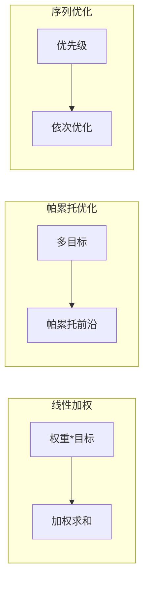
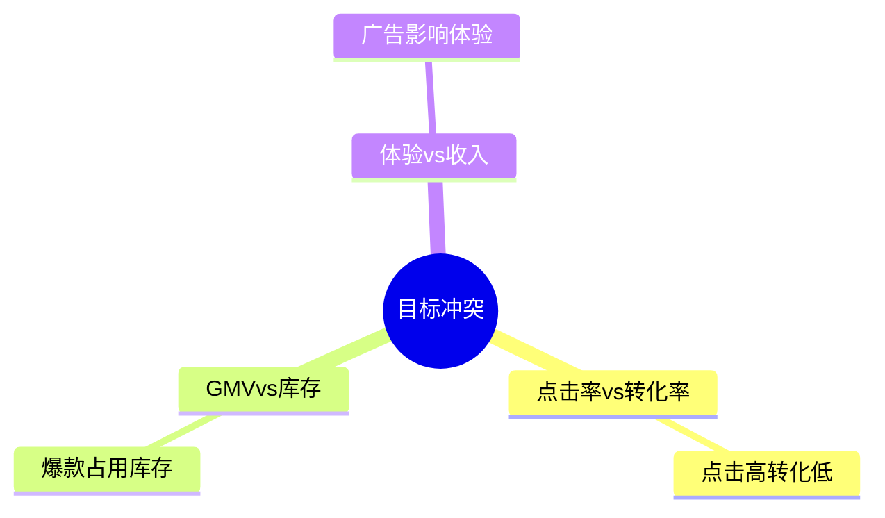

# 图8.22：目标权衡策略

## 权衡方法

```mermaid
flowchart LR
    subgraph 线性加权
        A[权重*目标] --> D[加权求和]
    end
    
    subgraph 帕累托优化
        B[多目标] --> E[帕累托前沿]
    end
    
    subgraph 序列优化
        C[优先级] --> F[依次优化]
    end
```

## 目标冲突

```mermaid
mindmap
  root((目标冲突))
    点击率vs转化率
      点击高转化低
    GMVvs库存
      爆款占用库存
    体验vs收入
      广告影响体验
```
