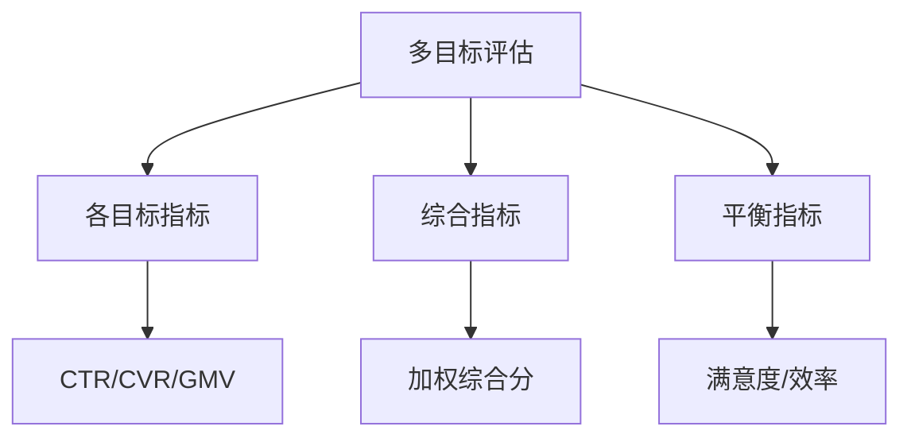
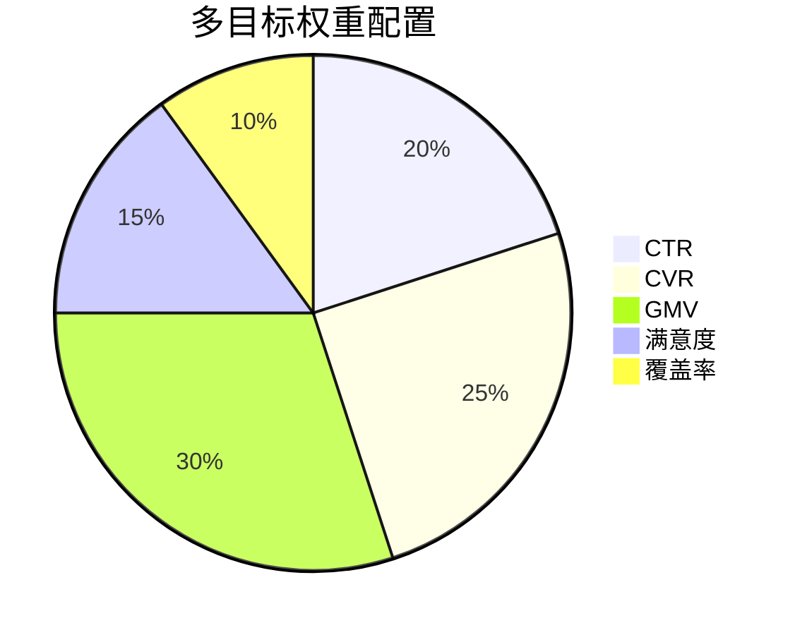

# 图8.23：多目标评测方法

## 评估指标设计

```mermaid
flowchart TD
    A[多目标评估] --> B[各目标指标]
    A --> C[综合指标]
    A --> D[平衡指标]
    
    B --> B1[CTR/CVR/GMV]
    C --> C1[加权综合分]
    D --> D1[满意度/效率]
```

## 加权策略

```mermaid
pie title 多目标权重配置
    "CTR" : 20
    "CVR" : 25
    "GMV" : 30
    "满意度" : 15
    "覆盖率" : 10
```
