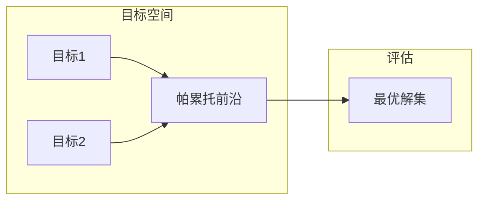
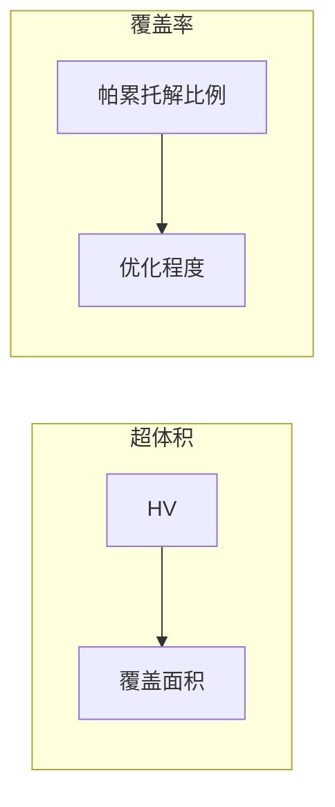

# 图8.24：帕累托优化评估

## 帕累托前沿

```mermaid
flowchart LR
    subgraph 目标空间
        A[目标1] --> D[帕累托前沿]
        B[目标2] --> D
    end
    
    subgraph 评估
        D --> E[最优解集]
    end
```

## 评估方法

```mermaid
flowchart LR
    subgraph 超体积
        A[HV] --> D[覆盖面积]
    end
    
    subgraph 覆盖率
        B[帕累托解比例] --> E[优化程度]
    end
```
