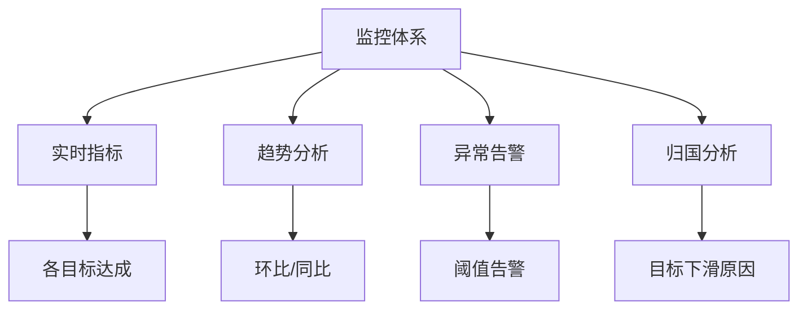
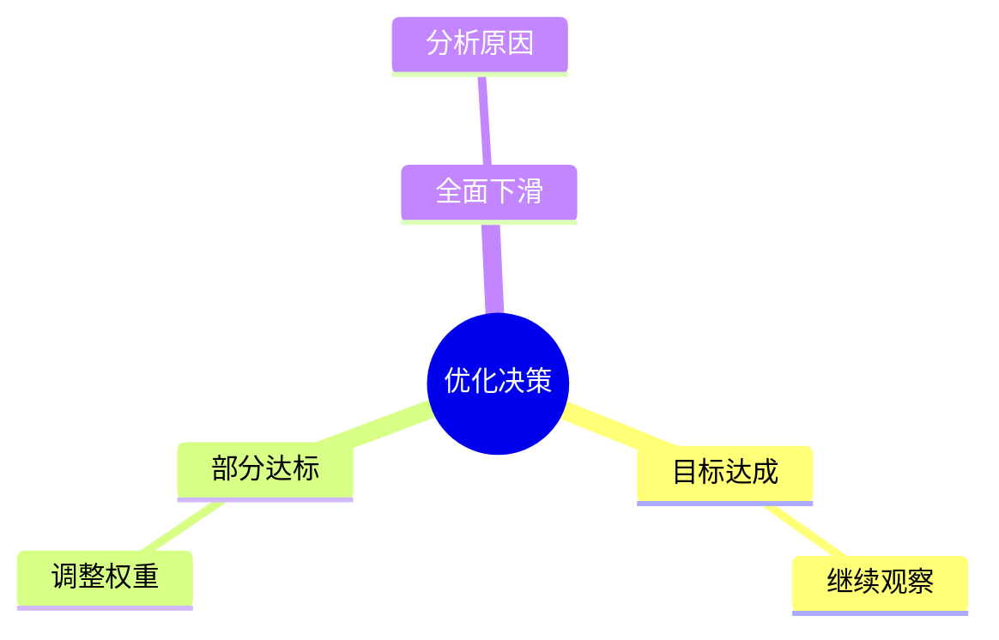

# 图8.25：多目标监控体系

## 监控仪表盘

```mermaid
flowchart TD
    A[监控体系] --> B[实时指标]
    A --> C[趋势分析]
    A --> D[异常告警]
    A --> E[归国分析]
    
    B --> B1[各目标达成]
    C --> C1[环比/同比]
    D --> D1[阈值告警]
    E --> E2[目标下滑原因]
```

## 优化建议

```mermaid
mindmap
  root((优化决策))
    目标达成
      继续观察
    部分达标
      调整权重
    全面下滑
      分析原因
```
