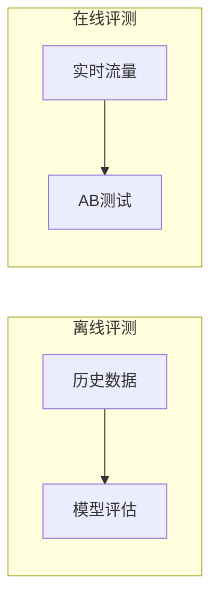
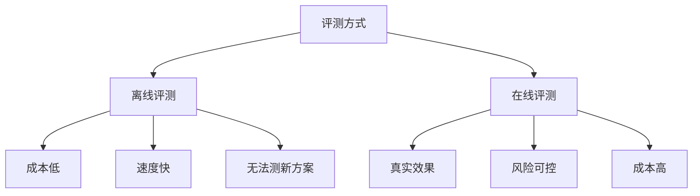

# 图8.26：离线与在线评测对比

## 评测范式对比

```mermaid
flowchart LR
    subgraph 离线评测
        A[历史数据] --> D[模型评估]
    end
    
    subgraph 在线评测
        B[实时流量] --> E[AB测试]
    end
```

## 优缺点

```mermaid
flowchart TD
    A[评测方式] --> B[离线评测]
    A --> C[在线评测]
    
    B --> B1[成本低]
    B --> B2[速度快]
    B --> B3[无法测新方案]
    
    C --> C1[真实效果]
    C --> C2[风险可控]
    C --> C3[成本高]
```
