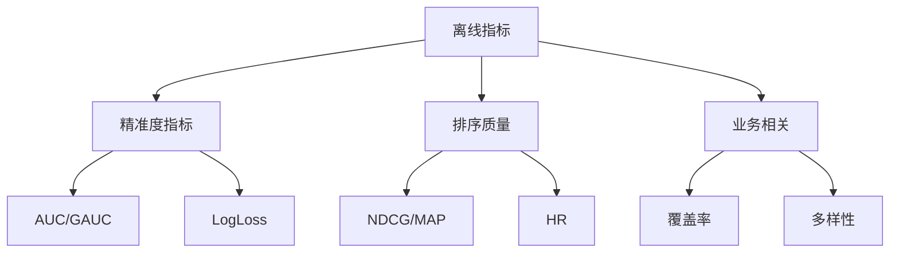

# 图8.27：离线评测指标

## 常用指标

```mermaid
flowchart TD
    A[离线指标] --> B[精准度指标]
    A --> C[排序质量]
    A --> D[业务相关]
    
    B --> B1[AUC/GAUC]
    B --> B2[LogLoss]
    
    C --> C1[NDCG/MAP]
    C --> C2[HR]
    
    D --> D1[覆盖率]
    D --> D2[多样性]
```
