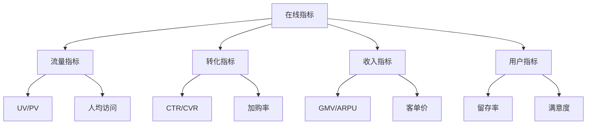
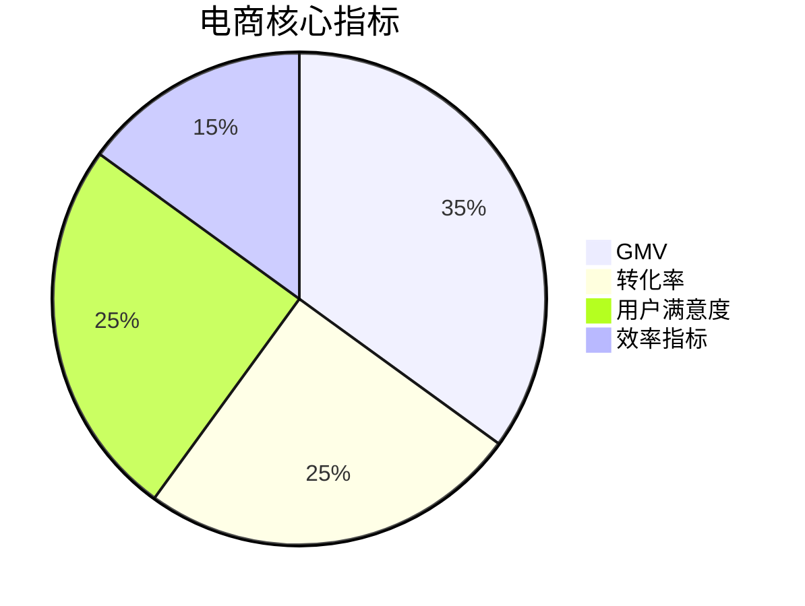

# 图8.28：在线评测指标

## 核心指标

```mermaid
flowchart TD
    A[在线指标] --> B[流量指标]
    A --> C[转化指标]
    A --> D[收入指标]
    A --> E[用户指标]
    
    B --> B1[UV/PV]
    B --> B2[人均访问]
    
    C --> C1[CTR/CVR]
    C --> C2[加购率]
    
    D --> D1[GMV/ARPU]
    D --> D2[客单价]
    
    E --> E1[留存率]
    E --> E2[满意度]
```

## 业务指标

```mermaid
pie title 电商核心指标
    "GMV" : 35
    "转化率" : 25
    "用户满意度" : 25
    "效率指标" : 15
```
