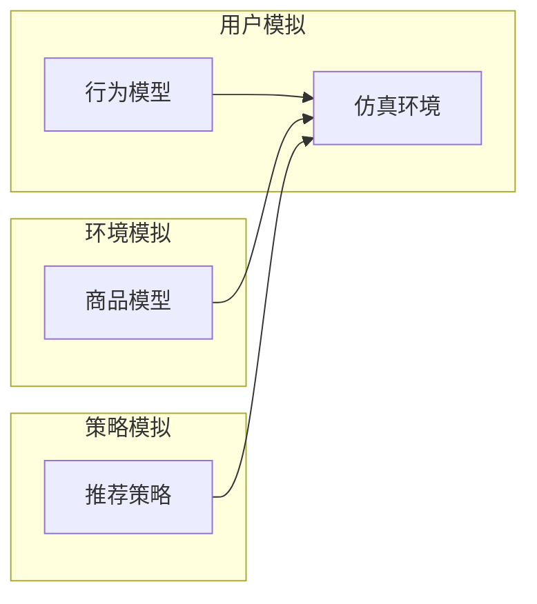
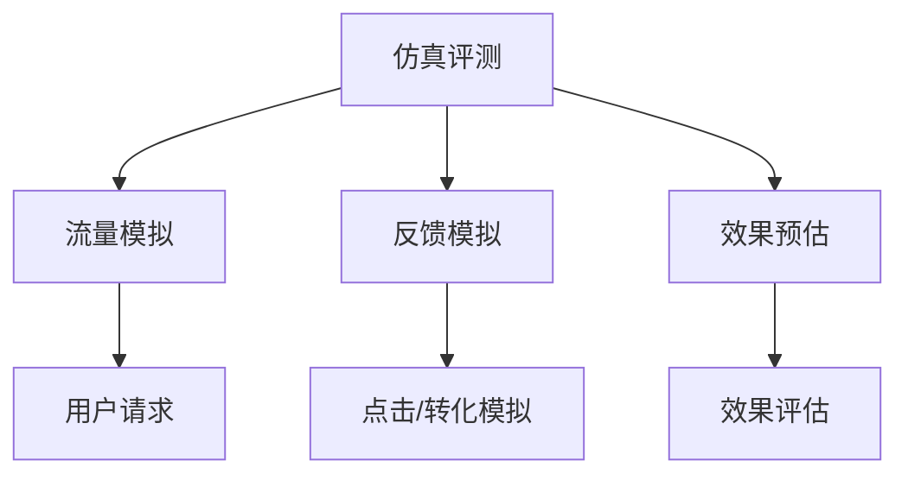

# 图8.29：仿真评测方法

## 仿真系统

```mermaid
flowchart LR
    subgraph 用户模拟
        A[行为模型] --> D[仿真环境]
    end
    
    subgraph 环境模拟
        B[商品模型] --> D
    end
    
    subgraph 策略模拟
        C[推荐策略] --> D
    end
```

## 仿真评估

```mermaid
flowchart TD
    A[仿真评测] --> B[流量模拟]
    A --> C[反馈模拟]
    A --> D[效果预估]
    
    B --> B1[用户请求]
    C --> C1[点击/转化模拟]
    D --> D2[效果评估]
```
