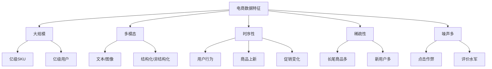

# 图8.2：电商数据特征分析

## 数据特征

```mermaid
flowchart TD
    A[电商数据特征] --> B[大规模]
    A --> C[多模态]
    A --> D[时序性]
    A --> E[稀疏性]
    A --> F[噪声多]
    
    B --> B1[亿级SKU]
    B --> B2[亿级用户]
    
    C --> C1[文本/图像]
    C --> C2[结构化/非结构化]
    
    D --> D1[用户行为]
    D --> D2[商品上新]
    D --> D3[促销变化]
    
    E --> E1[长尾商品多]
    E --> E2[新用户多]
    
    F --> F1[点击作弊]
    F --> F2[评价水军]
```
