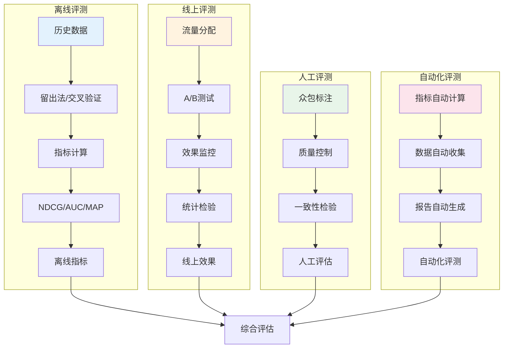

```mermaid
flowchart TB
    subgraph "离线评测"
        A[历史数据] --> B[留出法/交叉验证]
        B --> C[指标计算]
        C --> D[NDCG/AUC/MAP]
        D --> E[离线指标]
    end
    
    subgraph "线上评测"
        F[流量分配] --> G[A/B测试]
        G --> H[效果监控]
        H --> I[统计检验]
        I --> J[线上效果]
    end
    
    subgraph "人工评测"
        K[众包标注] --> L[质量控制]
        L --> M[一致性检验]
        M --> N[人工评估]
    end
    
    subgraph "自动化评测"
        O[指标自动计算] --> P[数据自动收集]
        P --> Q[报告自动生成]
        Q --> R[自动化评测]
    end
    
    E --> S[综合评估]
    J --> S
    N --> S
    R --> S
    
    style A fill:#e3f2fd
    style F fill:#fff3e0
    style K fill:#e8f5e9
    style O fill:#fce4ec
```
