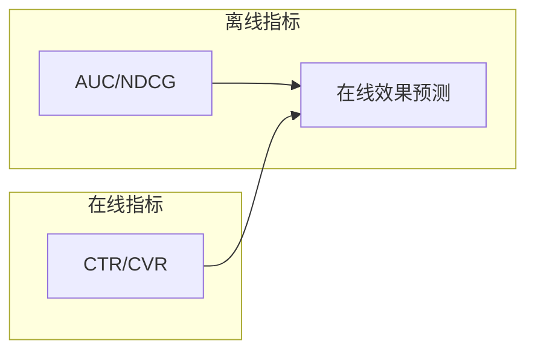
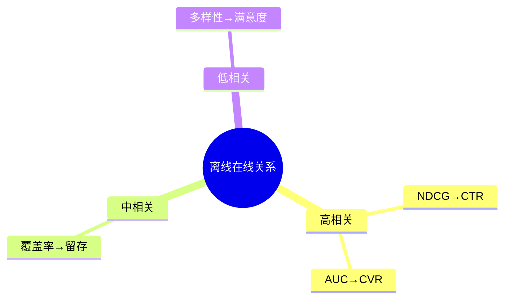

# 图8.30：离线在线指标映射

## 映射关系

```mermaid
flowchart LR
    subgraph 离线指标
        A[AUC/NDCG] --> D[在线效果预测]
    end
    
    subgraph 在线指标
        B[CTR/CVR] --> D
    end
```

## 相关性分析

```mermaid
mindmap
  root((离线在线关系))
    高相关
      NDCG→CTR
      AUC→CVR
    中相关
      覆盖率→留存
    低相关
      多样性→满意度
```
