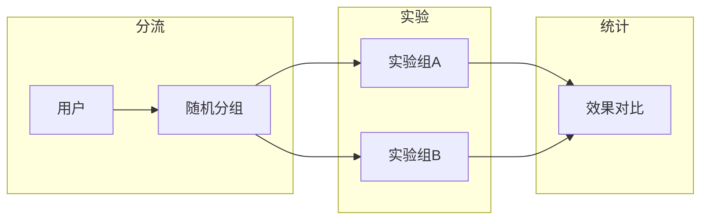
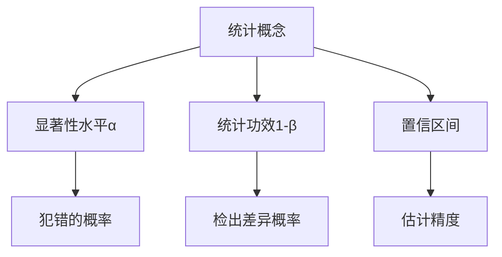

# 图8.31：A/B测试基础原理

## 测试框架

```mermaid
flowchart LR
    subgraph 分流
        A[用户] --> D[随机分组]
    end
    
    subgraph 实验
        D --> E[实验组A]
        D --> F[实验组B]
    end
    
    subgraph 统计
        E --> G[效果对比]
        F --> G
    end
```

## 核心概念

```mermaid
flowchart TD
    A[统计概念] --> B[显著性水平α]
    A --> C[统计功效1-β]
    A --> D[置信区间]
    
    B --> B1[犯错的概率]
    C --> C1[检出差异概率]
    D --> D2[估计精度]
```
