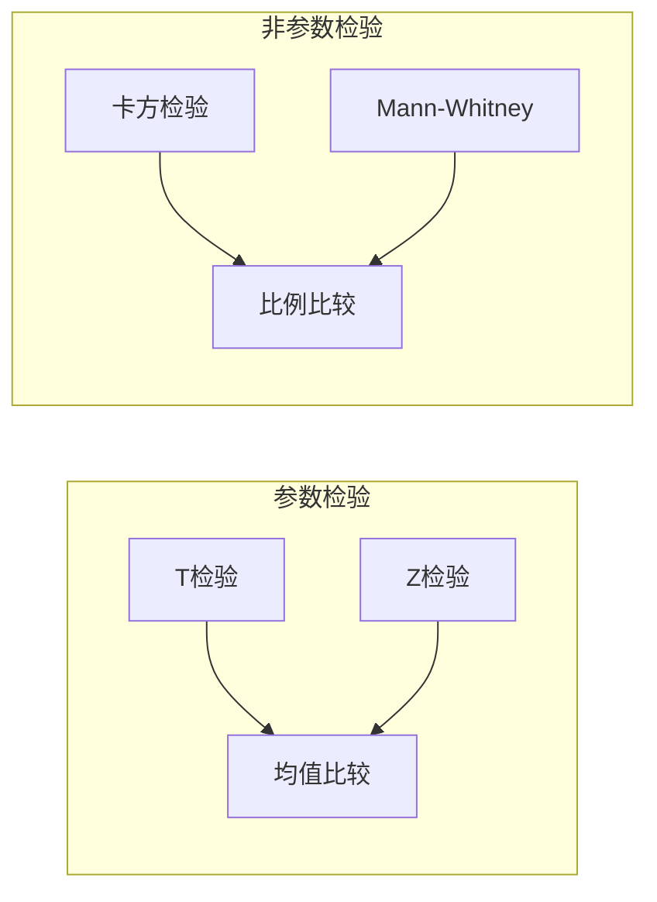
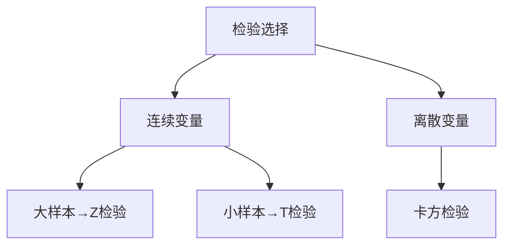

# 图8.32：统计检验方法

## 检验类型

```mermaid
flowchart LR
    subgraph 参数检验
        A[T检验] --> D[均值比较]
        B[Z检验] --> D
    end
    
    subgraph 非参数检验
        C[卡方检验] --> E[比例比较]
        D1[Mann-Whitney] --> E
    end
```

## 选择指南

```mermaid
flowchart TD
    A[检验选择] --> B[连续变量]
    A --> C[离散变量]
    
    B --> B1[大样本→Z检验]
    B --> B2[小样本→T检验]
    
    C --> C1[卡方检验]
```
