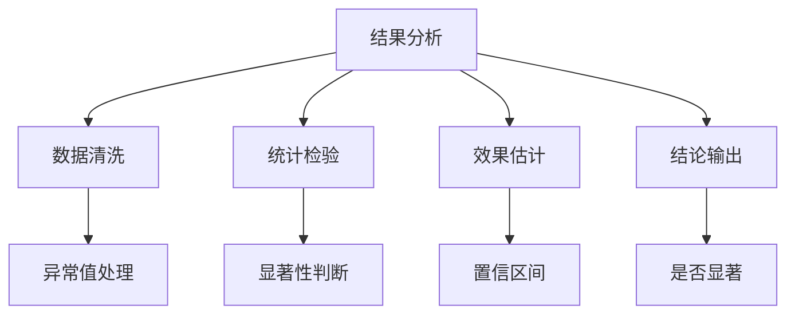
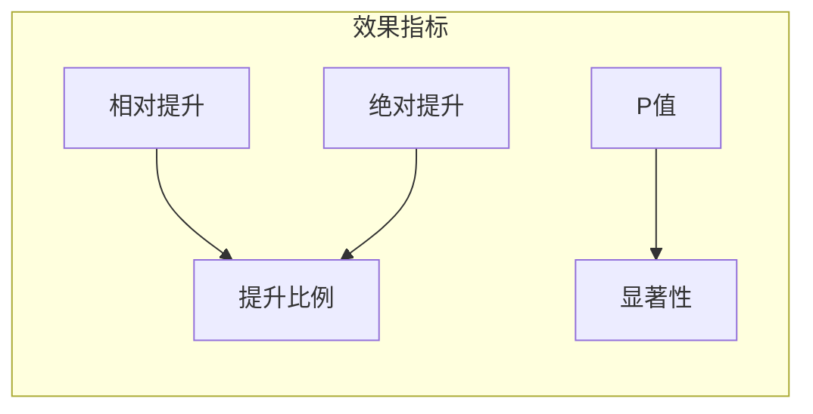

# 图8.33：A/B测试结果分析

## 分析流程

```mermaid
flowchart TD
    A[结果分析] --> B[数据清洗]
    A --> C[统计检验]
    A --> D[效果估计]
    A --> E[结论输出]
    
    B --> B1[异常值处理]
    C --> C1[显著性判断]
    D --> D1[置信区间]
    E --> E1[是否显著]
```

## 效果评估

```mermaid
flowchart LR
    subgraph 效果指标
        A[相对提升] --> D[提升比例]
        B[绝对提升] --> D
        C[P值] --> E[显著性]
    end
```
